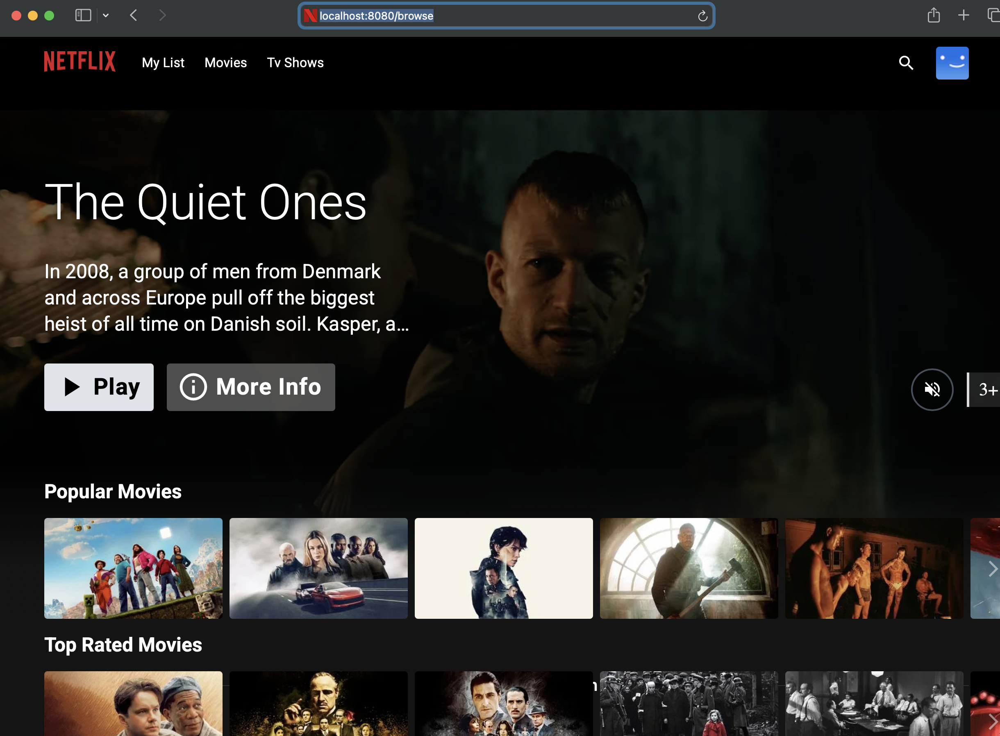
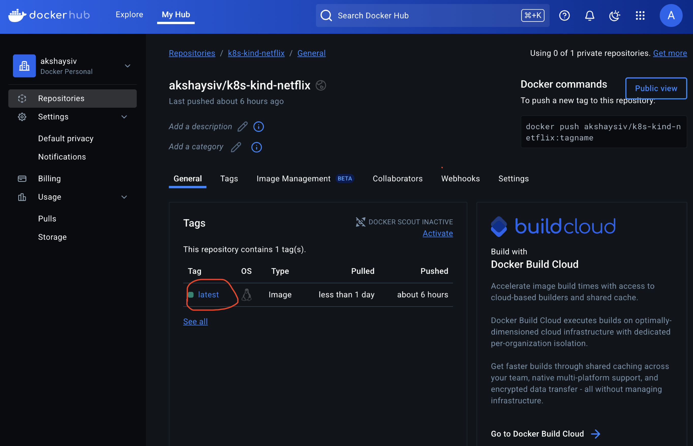

# Netflix Clone on kind Kubernetes Cluster

This project demonstrates how to deploy a simple **Netflix Clone** application on a local Kubernetes cluster using [`kind`](https://kind.sigs.k8s.io/).





## Prerequisites

Ensure the following tools are installed on your local machine:

- [Docker](https://www.docker.com/)
- [kind](https://kind.sigs.k8s.io/)
- [kubectl](https://kubernetes.io/docs/tasks/tools/)
- Clone [source code](https://github.com/AkshaySiv/k8s-kind-netflix)

## Project Structure

```
k8s-kind-netflix/
├── src /                     # Netflix clone app source code
│── Dockerfile 
├── k8s/
│   ├── deployment.yaml
│   └── service.yaml
└── README.md
```

## Steps to Deploy

### 1. Create a kind Cluster 

Create multi-node-kind-cluster.yaml file

```bash
kind: Cluster
apiVersion: kind.x-k8s.io/v1alpha4
nodes:
- role: control-plane
- role: worker
- role: worker
```

Run below command to create a multinode kind cluster in your local

```bash
kind create cluster --name multi-node-kind-cluster.yaml
```


### 2. Build the Docker Image and push to your docker registry

```bash
docker build --build-arg TMDB_V3_API_KEY=<your-api-key> -t akshaysiv/k8s-kind-netflix:latest .
docker push akshaysiv/k8s-kind-netflix
```




# Kubernetes Manifests

### deployment.yaml

```yaml
apiVersion: apps/v1
kind: Deployment
metadata:
  name: netflix-clone
spec:
  replicas: 1
  selector:
    matchLabels:
      app: netflix-clone
  template:
    metadata:
      labels:
        app: netflix-clone
    spec:
      containers:
      - name: netflix-clone
        image: akshaysiv/k8s-kind-netflix:latest
        ports:
        - containerPort: 80
```

### service.yaml

```yaml
apiVersion: v1
kind: Service
metadata:
  name: netflix-clone-service
spec:
  selector:
    app: netflix-clone
  ports:
    - protocol: TCP
      port: 80
      targetPort: 80
  type: ClusterIP
```

### 3. Deploy to kind

```bash
kubectl apply -f k8s/deployment.yaml
kubectl apply -f k8s/service.yaml
```

### 4. Access the Application

Expose the service locally (using port-forward):

```bash
kubectl port-forward svc/netflix-clone-service 8080:80
```

Visit your app at: [http://localhost:8080](http://localhost:8080)


## Cleanup

To delete the cluster:

```bash
kind delete cluster --name multi-node-kind-cluster
```

## Diagram


